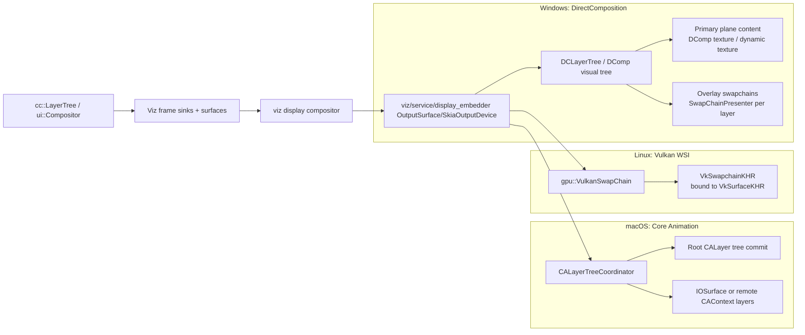

# Chromium swapchain strategy across desktop platforms

## Executive summary

Across desktop platforms, Chromium’s presentation model is **not** “one swapchain per layer,” and it is **not** uniformly “multiple swapchains per view” either. Instead, Chromium generally builds **one “primary” presentable output per native window/view** (the *root plane*), and then **optionally adds additional presentables** only on platforms where the window system supports **multi-plane / overlay composition** efficiently. citeturn32view1turn14view0turn18view3turn31view2turn27view0

On **Windows DirectComposition**, Chromium can (and often does) end up with **multiple presentables per HWND**: a root visual content plus per-overlay swapchains for video (and other special overlay modes). This happens because `DCLayerTree` may allocate a `SwapChainPresenter` **per overlay layer ID**, each owning its own `IDXGISwapChain1`, while the primary plane is presented via DComp visual content / dynamic texture paths. citeturn18view2turn22view0turn21view1turn14view0turn12search1

On **macOS**, the evidence points strongly to Chromium using a **Core Animation CALayer-tree delivery model** (CAContexts and/or IOSurface-backed layers) rather than multiple `CAMetalLayer` “swapchains per view.” The `AcceleratedWidgetMac` and `CALayerTreeCoordinator` APIs describe composited frames being committed as **CALayer trees** (including remotely-hosted layers) and/or as a **single IOSurface attached to a local CALayer**, with limited buffering managed at the Core Animation transaction level. citeturn26view0turn27view0turn28view1  
*Unspecified*: Chromium certainly uses Metal internally on macOS in many configurations, but in the sources examined here, the **presentation boundary for window content is explained in terms of CALayers/IOSurfaces/CAContexts**, not “multiple CAMetalLayers per NSView.” citeturn26view0turn27view0turn28view1

On **Linux with Vulkan**, the Vulkan WSI model itself ties a `VkSwapchainKHR` to a `VkSurfaceKHR`, and Chromium’s `gpu::VulkanSwapChain` is initialized with exactly one `VkSurfaceKHR` and creates exactly one `VkSwapchainKHR` (recreating it with `oldSwapchain` when needed). This strongly supports **one swapchain per native surface/window**, not multiple swapchains per view. citeturn31view2turn31view0turn30search30turn30search2

The unifying pattern is: **Chromium composes most UI/content via Viz surface aggregation into one main output**, then uses **overlay-specific additional presentables only where they buy power/perf wins** (e.g., Windows video overlays with multiple per-layer swapchains). The “multiple swapchains per view” claim is therefore **true for Windows (conditionally), but not supported as a general cross-platform rule** by the primary sources reviewed. citeturn32view1turn18view3turn31view2turn26view0

## Baseline architecture and where swapchains fit

Chromium’s modern desktop rendering stack is easiest to reason about as two layers:

* **Compositing model (platform-agnostic)**: compositor trees in `cc` and higher-level wrappers (`ui::Compositor`, etc.) generate frames. The macOS delegated rendering design document explicitly describes `ui::Compositor` as a wrapper around `cc::LayerTreeHost`, and it distinguishes **direct rendering** vs **delegated rendering** (renderer produces quads that browser composites). citeturn28view0turn28view1  
* **Presentation model (platform-specific)**: Viz’s “display compositor” produces the final backing store for display, and the “display_embedder” layer performs platform-specific **SwapBuffers/present** and **overlay plumbing**. Viz’s own README documents that:  
  * the **display compositor** composites multiple clients’ frames into a single backing store, and  
  * **display_embedder** provides platform behavior for presentation and overlays. citeturn32view1turn32view2

This matters because a “swapchain per view” is a *presentation* concern, not a “per layer tree” concern. Chromium’s core compositor produces a **single composed output frame** (plus optional overlay candidates), and the platform embedder decides whether to:
1) present only the composed output, or  
2) present the composed output + additional overlay planes (which may involve additional swapchains or layer-backed surfaces). citeturn32view1turn14view0turn18view3

image_group{"layout":"carousel","aspect_ratio":"16:9","query":["Chromium Viz display compositor architecture diagram","Windows DirectComposition visual tree swapchain diagram","Core Animation CAContext CALayer tree diagram","Vulkan swapchain VkSurfaceKHR diagram"],"num_per_query":1}

The key Windows/Mac/Linux implementation files reviewed below all sit squarely in **platform presentation** components—either Viz display_embedder or platform GL/Vulkan/CALayer infrastructure—rather than in `cc` itself. citeturn32view2turn14view0turn27view0turn31view0

## Windows DirectComposition implementation

### What is “the view” and how does output get attached

The window system “view” here is an `HWND` that DirectComposition targets. DirectComposition is explicitly meant for high-performance bitmap composition: it composes bitmaps with transforms/effects, but it does not itself rasterize; apps provide bitmap/texture content that DComp/DWM composes. citeturn19search2turn19search29

Chromium’s DirectComposition stack is organized around a **DComp visual tree** built by `gl::DCLayerTree` and fed by Viz output devices:

* `viz::SkiaOutputDeviceDComp` sets output-surface capabilities for DComp, including buffer count and overlay support, and forwards overlay scheduling to a `gl::Presenter` (which ultimately drives DCLayerTree). citeturn14view0turn15view2  
* `gl::DCLayerTree` owns the DComp root visual and is responsible for creating/updating per-overlay visuals and committing to the DComp device. citeturn16view0turn17view2turn18view0

### Does Windows use multiple swapchains per view

**Yes—conditionally.** Windows is the clearest example where “multiple swapchains per view” matches the concrete code:

1) **Primary plane/root content**:  
   * `SkiaOutputDeviceDComp` exposes the number of on-screen buffers via `capabilities_.number_of_buffers = gl::DirectCompositionRootSurfaceBufferCount()` and sets `max_pending_swaps = number_of_buffers - 1`, which is a direct expression of **double/triple buffering policy** at the primary output-surface level. citeturn14view0  
   * The DComp support level is detected as `kDCLayers`, `kDCompTexture`, or `kDCompDynamicTexture` depending on whether DirectComposition textures and the newer `IDCompositionDevice5` path are available. citeturn14view0  
   * A 2025 CL (“Use preview dirty region API for IDCompositionTexture”) explicitly introduces a “dynamic texture” object described in the CL text as “like a swap chain” for the primary plane, owned as `primary_plane_surface_` by `DCLayerTree` to track incremental damage. citeturn12search1turn17view1

2) **Additional per-overlay swapchains** (the core “multiple swapchains” mechanism):  
   * `DCLayerTree` decides which overlays require a swapchain by `NeedSwapChainPresenter()`, which returns true when an overlay image exists and its type is not `kDCompVisualContent`. citeturn16view0turn18view3  
   * For each such overlay, `DCLayerTree` maintains a `video_swap_chains_` map and creates (or reuses) a `SwapChainPresenter` **per `gfx::OverlayLayerId`**. It then calls `SwapChainPresenter::PresentToSwapChain(...)` and replaces the overlay image with the swapchain-backed result. citeturn18view2turn18view3turn17view0  
   * The `SwapChainPresenter` header is unambiguous: “**SwapChainPresenter holds a swap chain … for a single overlay layer**.” citeturn22view0  

Taken together, a single HWND can have:
* one primary plane presentable (DComp texture/dynamic texture path with buffering), plus  
* N overlay-layer swapchains (often video-related), depending on overlay candidacy and content. citeturn14view0turn18view3turn22view0

### Why multiple swapchains are used on Windows

The code indicates several concrete drivers:

* **Video and overlay presentation modes**: The `SwapChainPresenter` encapsulates multiple video presentation modes (decode swap chain, video processor blit variants, MF surface proxy) and can switch resources when contents/properties change. citeturn22view0turn22view2turn21view1  
* **Protected video and overlay flags**: In swapchain reallocation, Chromium sets DXGI swapchain flags for video use, fullscreen video, optional tearing, and display-only/hardware-protected modes. citeturn21view0turn22view2  
* **Synchronization constraints with DWM reading textures**: `SkiaOutputDeviceDComp` is careful not to end read access for “DComp visual content” textures because “DWM can read from them for potentially multiple frames,” while other overlays are handled either by DComp surfaces or by `SwapChainPresenter` copying into an internal swapchain. This is a direct, code-level rationale for why some overlays must be “buffered behind a swapchain boundary” instead of exposing a resource directly to DWM. citeturn15view0  

### Relevant code paths and key classes

Primary paths (Windows DComp / overlays):

* `components/viz/service/display_embedder/skia_output_device_dcomp.cc`  
  * `SkiaOutputDeviceDComp::Present`  
  * `SkiaOutputDeviceDComp::ScheduleOverlays`  
  * `SkiaOutputDeviceDComp::Reshape`  
  * Feature: `kDirectCompositionResizeBasedOnRootSurface` and capability `resize_based_on_root_surface` citeturn14view0turn15view3
* `ui/gl/dc_layer_tree.cc`  
  * `NeedSwapChainPresenter`  
  * `DCLayerTree::CommitAndClearPendingOverlays` (manages `video_swap_chains_`, calls `SwapChainPresenter::PresentToSwapChain`, commits DComp device) citeturn16view0turn18view3turn17view2  
  * Source comment documents a real-world DComp ABI hazard: unconditional casting to `IDCompositionVisual3` caused crashes on early Windows 10; Chromium now gates usage and references crbug 1455666. citeturn16view0
* `ui/gl/swap_chain_presenter.h/.cc`  
  * Contract: one swapchain presenter per overlay layer; returns a new `DCLayerOverlayImage` representing the video overlay after presenting. citeturn22view0turn21view1

Broader embedding context:

* Viz “display_embedder” is explicitly the place where Chromium houses “SwapBuffers” and overlay support, per Viz documentation. citeturn32view1turn32view2

### Historical decisions and regressions influencing behavior

Several Windows-specific CLs/bugs directly describe why DComp’s multi-step nature matters:

* **Incremental damage / “dynamic texture” for primary plane**: A 2025 CL introduces `IDCompositionDynamicTexture` and states it is “like a swap chain” and `DCLayerTree` will own a single one for the primary plane (buffer-queue + IDCompositionDevice5 devices). citeturn12search1turn17view1  
* **Resize artifacts and inability to update atomically**: A 2025 CL (“Fix visual artifacts while resizing window with DComp”) explains that Windows does not allow synchronizing window resize, clip rect update, and repaint atomically; unpainted regions become visible during live resize. citeturn12search3  
* **Root-surface resize strategy**: Another 2025 CL (“Fix visual artifacts due to resizing root render pass with DComp”) explains how resizing logic interacts with DComp “gutters” and stale pixels, and it explicitly ties the fix to `RootCompositorFrameSinkImpl::SubmitCompositorFrame` behavior and a feature-flag kill switch. citeturn13view0turn14view0  

These are not just anecdotal: they reveal that the precise mapping between “composited frame size,” “viewport,” and “DComp visual clip/viewporter” is a correctness/perf constraint, and they explain why Chromium sometimes changes which object is resized (viewport vs render pass vs surface). citeturn13view0turn12search3turn14view0

## macOS Metal and Core Animation implementation

### What Chromium presents on macOS

The clearest, most direct description in the reviewed sources is that Chromium’s macOS widget/presentation layer is built around **Core Animation layers** and **cross-process CAContext delivery**, with optional **IOSurface-backed content**:

* `AcceleratedWidgetMac` “owns a tree of CALayers,” including **hosted CoreAnimation layers from the GPU process** and a **local CALayer whose contents is set to an IOSurface**. Its `GotFrame(...)` method explicitly takes CAContext IDs and an IOSurface, and updates the CALayer tree accordingly. citeturn26view0  
* `CALayerTreeCoordinator` (GPU process) “holds the tree of CALayers to display composited content” and states that the tree is “sent to the browser process via the cross-process CoreAnimation API.” It tracks a queue of “presented frames” and commits the presented frame’s “OpenGL backbuffer or CALayer tree” to the root CALayer. citeturn27view0  
* The macOS delegated rendering design doc describes two macOS strategies historically: drawing into IOSurface-backed resources and drawing via CAContexts (CARemoteLayer / CAContext), with the browser compositor owning a subtree of CALayers that draw the compositor output. citeturn28view0turn28view1  

### Does macOS use multiple CAMetalLayers per view

**Not supported by the primary sources reviewed here; the dominant documented strategy is CALayer/IOSurface/CAContext, not multiple `CAMetalLayer`s.** Concretely:

* `AcceleratedWidgetMac` is described in terms of CALayerHost (remote CA layers) and a local CALayer whose contents is an IOSurface. No mention is made of constructing multiple CAMetalLayers per NSView in this presentation path. citeturn26view0  
* `CALayerTreeCoordinator` frames the present/commit boundary as committing a CALayer tree to Core Animation, with a bounded number of pending CALayer trees (`presented_ca_layer_trees_max_length_ = 2`), which is effectively a Core Animation–level **frame queue** rather than “swapchain per layer.” citeturn27view0  

**Important nuance (Metal’s general model)**: On macOS in general (not necessarily Chromium’s chosen presentation API), a `CAMetalLayer` behaves like a swapchain: it vends drawables from a pool. Apple documents that `nextDrawable()` returns the next drawable from the pool and will wait (up to about one second) if all drawables are in use, and `maximumDrawableCount` controls the number of drawables in the pool. citeturn29search0turn29search2turn29search4  
This provides a concrete platform constraint: “too many outstanding frames” can stall drawable acquisition, which shows why graphics stacks often carefully manage buffering depth. citeturn29search0turn29search2

**Unspecified**: Whether Chromium internally uses `CAMetalLayer` in some configurations (for example, for specific GPU backends or embedder flows) is not established by the sources examined here; what is established is that the macOS window presentation boundary exposed by `AcceleratedWidgetMac`/`CALayerTreeCoordinator` is CALayer-tree based. citeturn26view0turn27view0

### Multiple presentables per view on macOS: what *does* scale “per layer”

While “multiple CAMetalLayers per view” is not evidenced, Chromium *can* still present multiple independently composited planes via **multiple CALayers** (overlays):

* `CALayerTreeCoordinator` is explicitly a “tree of CALayers” used to display composited content, and its present/commit semantics are expressed in terms of committing layers in a transaction. citeturn27view0  
* The Viz architecture explicitly positions macOS (Apple platforms) as having a platform overlay path (`ca_layer_overlay`) in the display compositor. Although this report did not extract the full contents of `ca_layer_overlay.cc`, its existence and role are consistent with Viz’s documented “display_embedder supports overlays.” citeturn8view0turn32view2turn25search14  

So the macOS “multi-plane” story is best described as **multi-CALayer** composition, not “multi-swapchain.” citeturn27view0turn26view0turn32view2

## Linux GTK with Vulkan, X11, and Wayland

### Vulkan: one swapchain per VkSurfaceKHR in Chromium’s implementation

Chromium’s Vulkan WSI wrapper (`gpu::VulkanSwapChain`) is structurally aligned with Vulkan’s own WSI model:

* `VulkanSwapChain::Initialize` takes exactly one `VkSurfaceKHR surface`, then calls `InitializeSwapChain(surface, …)` and `vkCreateSwapchainKHR` with `.surface = surface`. citeturn31view0turn31view2  
* The swapchain recreation path uses Vulkan’s `oldSwapchain` mechanism: if an old swapchain exists, Chromium sets `swap_chain_create_info.oldSwapchain = old_swap_chain->swap_chain_` before creating the new swapchain. citeturn31view2  
* Swapchain images are queried via `vkGetSwapchainImagesKHR` into `images_`, reinforcing that this object is a direct wrapper around a single `VkSwapchainKHR`. citeturn31view3  

This makes “multiple `VkSwapchainKHR` per native view” **unlikely as a steady-state design** for a single window surface: the normal design is **one swapchain per surface**, occasionally creating a new swapchain during resize/reconfigure while referencing the old one until safe cleanup. citeturn31view2turn31view0turn30search30

### Swapchain recreation and out-of-date rules (platform constraint)

The core Vulkan constraint is that swapchains become incompatible with the surface (commonly on resize), producing `VK_ERROR_OUT_OF_DATE_KHR` or `VK_SUBOPTIMAL_KHR` at acquire/present time and requiring recreation. This behavior is widely documented in Vulkan WSI discussions and tutorials, and Chromium’s `oldSwapchain` usage matches that standard lifecycle. citeturn30search2turn30search30turn31view2

### How the swapchain relates to a “native view” under X11/Wayland/GTK

In Chromium’s Viz output-device split, Vulkan presentation is represented by a specific output device:

* `SkiaOutputDeviceVulkan` is constructed with a single `gpu::SurfaceHandle` and includes `gpu/vulkan/vulkan_swap_chain.h`, indicating it owns/uses the Vulkan swapchain for that one native surface handle. citeturn7search1  
* `SkiaOutputSurfaceImplOnGpu` includes `SkiaOutputDeviceVulkan` (guarded by `ENABLE_VULKAN`) and also includes Ozone `PlatformWindowSurface`/`SurfaceFactoryOzone` headers, showing the intended integration: the GPU-side output device is created for a platform window and then presents through that platform’s surface abstraction. citeturn7search3turn30search0  

So the intended mapping is:
*one platform window surface* → *one `VkSurfaceKHR`* → *one `VkSwapchainKHR` (recreated as needed)*. citeturn31view2turn7search1turn7search3

### Wayland/X11 constraints observed in Chromium bugs

Wayland/Vulkan integration in Chromium is constrained not only by Vulkan WSI but also by Chromium’s chosen GPU backends and platform glue. For example, a Chromium issue explicitly notes that `gl=egl-angle,angle=vulkan` is not supported on Ozone/Wayland (it “only works on X11/XWayland”). citeturn30search7  
This is relevant because it affects *which* backend even gets to the point of creating a Vulkan swapchain on a Wayland surface. ƒ citeturn30search7

**Unspecified**: The exact GTK embedding chain (GTK widget → Ozone surface → VkSurfaceKHR creation site) is not fully established here (it would require pulling additional Ozone Wayland/X11 surface-factory sources). However, Chromium’s Vulkan swapchain wrapper itself is clearly “one swapchain per surface” in design. citeturn31view2turn7search1

## Comparison and implications

### Per-platform strategy summary

| Platform | Uses multiple swapchains per view? | If yes: how many and why | If no: alternative approach | Key code locations | Notable bugs/CLs |
|---|---|---|---|---|---|
| Windows (DirectComposition) | **Yes (conditional)** citeturn18view3turn22view0 | 1 primary output (buffered) + **N overlay swapchains** (typically video) via per-layer `SwapChainPresenter`, plus “dynamic texture” primary-plane optimization on supported OS/drivers. citeturn14view0turn18view3turn22view0turn12search1 | — | `components/viz/service/display_embedder/skia_output_device_dcomp.cc`; `ui/gl/dc_layer_tree.cc`; `ui/gl/swap_chain_presenter.{h,cc}` citeturn14view0turn18view3turn22view0turn21view1 | Incremental damage “dynamic texture” CL citeturn12search1; resize/clip atomicity limitation CL citeturn12search3; Visual3 cast crash guard citeturn16view0 |
| macOS | **Not evidenced for multiple CAMetalLayers per view** citeturn26view0turn27view0 | — | Present as **CALayer trees** (CAContexts / remote layers) and/or **IOSurface-backed CALayer contents**; buffering expressed as pending CALayer trees/frames committed to Core Animation. citeturn26view0turn27view0turn28view1 | `ui/accelerated_widget_mac/accelerated_widget_mac.h`; `ui/accelerated_widget_mac/ca_layer_tree_coordinator.h` citeturn26view0turn27view0 | Delegated rendering design doc (historical) citeturn28view0 |
| Linux (Vulkan on X11/Ozone) | **No (steady state)** citeturn31view2turn7search1 | — | **Single `VkSwapchainKHR` per `VkSurfaceKHR`**, recreated via `oldSwapchain` when surface changes. citeturn31view2turn30search2turn30search30 | `gpu/vulkan/vulkan_swap_chain.cc`; `components/viz/service/display_embedder/skia_output_device_vulkan.h` citeturn31view2turn7search1 | Vulkan-on-Wayland backend constraints (ANGLE combo) citeturn30search7 |

### Relationship diagram: compositor to output device to presentables

This diagram reflects what the code and platform docs make explicit: the majority of Chromium’s complexity sits at the “present” boundary, not in the primary layer tree building. citeturn32view1turn14view0turn27view0turn31view2

### Performance, latency, and tearing considerations

**Windows DComp**

Chromium explicitly exposes multi-buffering at the output surface level (`number_of_buffers`, `max_pending_swaps`) and separately controls swapchain flags for overlay swapchains (including optional tearing via DXGI allow-tearing flags). These choices trade latency vs throughput and affect whether presentation can tear under certain conditions. citeturn14view0turn21view0  
Windows DComp also has correctness/perception constraints: Chromium’s CLs document visual artifacts during live resize due to the inability to update window size, clip rect, and repaint atomically—an example of a platform constraint that influences output sizing and damage handling. citeturn12search3turn13view0turn14view0

**macOS Core Animation**

Even though Chromium’s macOS presentation boundary here is CALayer-tree based, Apple’s CAMetalLayer “swapchain-like” drawable pool highlights a general macOS performance/latency constraint: drawable acquisition can block when too many frames are in flight, and the drawable pool size is explicitly bounded (`maximumDrawableCount`). This motivates careful backpressure and buffering control, which Chromium also models at the CALayer-tree coordinator level (bounded pending presented frames). citeturn29search0turn29search2turn27view0

**Linux Vulkan**

Vulkan WSI imposes strict swapchain lifecycle rules tied to surface compatibility. Chromium’s explicit usage of `oldSwapchain` and its swapchain creation and image management demonstrate a conventional pattern: keep a single active swapchain per surface, recreate on out-of-date/suboptimal events, and manage synchronization with semaphores/fences. citeturn31view2turn31view3turn30search2turn30search30

### Alternatives Chromium uses instead of “many swapchains per view”

The sources reviewed reinforce that Chromium’s dominant strategy is *not* “swapchains everywhere,” but rather:

* **Surface aggregation / single composed backing store**: Viz’s display compositor is described as composing frames from multiple clients into a single backing store, with platform embedder providing overlays and SwapBuffers. citeturn32view1turn32view2  
* **Platform overlay systems instead of per-layer swapchains**:  
  * On Windows, overlays sometimes map to **additional swapchains** (`SwapChainPresenter`) and sometimes to DComp textures directly, depending on what DWM can safely read and how the content is produced. citeturn15view0turn22view0turn18view3  
  * On macOS, overlays are naturally expressed as additional **CALayers** in a committed layer tree. citeturn27view0turn26view0  
* **Android-style SurfaceControl/SurfaceFlinger** (requested dimension): while not deeply inspected here, Chromium’s own history/CL listings show an `overlay_processor_surface_control.cc` implementation, strongly implying that on Android it uses **SurfaceControl-based delegated composition** rather than desktop-style swapchains per layer. citeturn11search7  

## Key takeaways

Chromium does **not** follow a single cross-platform rule like “multiple swapchains per view.” The platform reality is:

* **Windows (DComp)**: multiple presentables per view are a first-class design, with per-overlay swapchains used when needed (especially for video) and a buffered primary plane. citeturn18view3turn22view0turn14view0turn12search1  
* **macOS**: the documented/visible presentation boundary is **Core Animation layer trees** (CAContext / IOSurface-backed CALayers), not multiple CAMetalLayers. citeturn26view0turn27view0turn28view1  
* **Linux (Vulkan/X11/Ozone)**: the code supports the standard Vulkan WSI model: **one swapchain per surface** (recreated under `VK_ERROR_OUT_OF_DATE_KHR`/suboptimal rules), not many per view. citeturn31view2turn30search2turn30search30turn7search1  

Where Chromium does “multiply presentables,” it does so to exploit **overlay composition** (reduced power, better video-path performance, protected content handling, fewer copies)—and the Windows DirectComposition implementation is the most explicit instance of that strategy. citeturn15view0turn22view0turn21view1